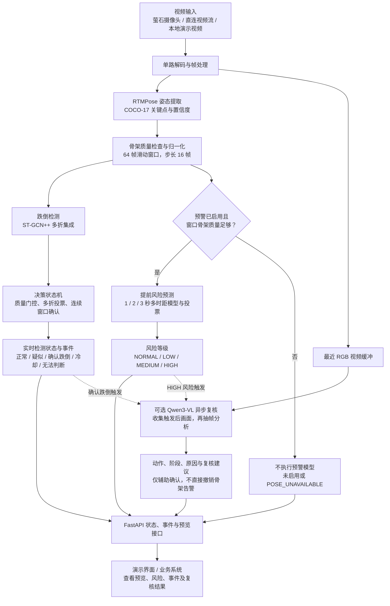

# 基于人体姿态的跌倒检测基准与系统原型

> GitHub 交付版保留源码、配置模板、文档、演示素材和结果表；新增的大批实验图片及特征缓存暂缓上传，本地原文件保留。模型权重、原始数据集和虚拟环境需另行准备。

本项目以统一数据、骨架接口、训练划分和评价指标比较跌倒检测路线，并为后续摄像头系统提供算法与软件基础。当前已完成 **7 个姿态/跟踪前端 × 3 个时序分类器的 21 路正交网格，以及两条 RTMPose + ByteTrack 消融，共 23 条路线**的四折 300 轮内部实验。下一阶段是设备接入、多人跟踪修复和现场数据验证。

## 模块流程图

下面展示启用 RTMPose 路线后的在线处理流程。跌倒检测判断“是否已经跌倒”，可选预警分支估计未来 **1 / 2 / 3 秒**风险；可选 Qwen 分支对触发事件补充视频语义解释。



实线表示处理或结果传递，虚线表示自动复核触发。两条骨架分支共享视频连接、姿态结果和窗口；多模态分支只在启用并满足触发条件时运行，不是对每一帧调用大模型。

### 各环节负责什么

| 环节 | 作用与输出 | 主要实现 |
|---|---|---|
| 视频接入 | 解析视频源、单路拉流、维护帧与事件状态 | [`app/ezviz.py`](app/ezviz.py)、[`app/stream_service.py`](app/stream_service.py) |
| 骨架与窗口 | 提取姿态，检查有效关节、躯干、骨骼比例及目标跳变，构建时序输入 | [`app/realtime.py`](app/realtime.py)、[`app/pose_quality.py`](app/pose_quality.py) |
| 跌倒检测 | 多折模型输出跌倒概率，状态机确认事件并控制冷却 | [`app/pipeline.py`](app/pipeline.py)、[`app/decision.py`](app/decision.py)、[`models/gcn_models.py`](models/gcn_models.py) |
| 提前风险预测（可选） | 输出 1 / 2 / 3 秒风险概率和投票结果；当前权重需配合 RTMPose | [`app/prefall.py`](app/prefall.py) |
| 视频语义复核（可选） | 异步输出动作类别、阶段、原因和融合建议 | [`app/multimodal.py`](app/multimodal.py) |
| 系统交付 | 通过接口提供状态、事件、画面和演示页面 | [`app/webapp.py`](app/webapp.py)、[`app/demo_ui.py`](app/demo_ui.py) |

### 如何理解结果

- **先预警、后复核**：骨架检测和风险提示立即输出，不等待 Qwen。默认自动复核在 `HIGH` 或确认跌倒时触发，继续收集约 2.5 秒画面，再从 RGB 缓冲中抽取 8 帧；实际参数可配置。
- **无法判断不等于正常**：未积累满窗口时为 `WARMUP`；骨架质量不足时，检测状态可为 `UNKNOWN`，预警分支为 `POSE_UNAVAILABLE`，不会执行预警模型。
- **确认跌倒优先于提前预测**：检测确认后，预警结果转为 `FALL_CONFIRMED`，冷却阶段转为 `RESPONSE_ACTIVE`，避免继续把已发生事件描述为未来风险。
- **复核结果是辅助信息**：Qwen 未确认、解析失败或运行异常均不能直接取消骨架告警；当前预警分支仍属实验功能，不应单独触发紧急外部动作。

接入时可从 `GET /v1/streams/status` 读取 `latest_result`（含 `prefall_prediction` 和 `multimodal_review`），从 `GET /v1/events` 获取事件；`GET /v1/preview.mjpg` 提供画面预览。详细配置见[视频服务说明](docs/FASTAPI_CAMERA_SERVICE.md)、[提前预警集成](docs/PREFALL_FASTAPI_INTEGRATION.md)和[多模态复核集成](docs/MULTIMODAL_FASTAPI_INTEGRATION.md)。

## 快速查看结果

- 一页式项目全貌：[`项目概要.md`](项目概要.md)
- 23 路模型对比与最终结论：[`docs/MODEL_ROUTE_COMPARISON.md`](docs/MODEL_ROUTE_COMPARISON.md)
- 全部路线、全部指标：[`docs/ALL_ROUTE_METRICS.md`](docs/ALL_ROUTE_METRICS.md)
- RTMPose + ByteTrack 独立重训与丢轨分析：[`docs/RTMPOSE_BYTETRACK_RETRAIN.md`](docs/RTMPOSE_BYTETRACK_RETRAIN.md)
- RTMPose 正式系统演示与滑窗冒烟验证：[`docs/FINAL_SYSTEM_DEMO.md`](docs/FINAL_SYSTEM_DEMO.md)
- 部署对齐滑窗训练、指标与复现：[`docs/SLIDING_WINDOW_TRAINING.md`](docs/SLIDING_WINDOW_TRAINING.md)
- 困难负样本重训练消融：[`results/hard_negative_ablation/README.md`](results/hard_negative_ablation/README.md)
- MMPose Hourglass52 环境与实验：[`docs/MMPOSE_HOURGLASS.md`](docs/MMPOSE_HOURGLASS.md)
- 正式内部结果：[`results/benchmark_summary.csv`](results/benchmark_summary.csv)
- 正式外部结果：[`results/mcfd_external_benchmark/summary.csv`](results/mcfd_external_benchmark/summary.csv)
- 中文阶段报告：[`results/三路线阶段实验报告.md`](results/三路线阶段实验报告.md)
- 错误与融合分析：[`results/mcfd_error_analysis/错误分析报告.md`](results/mcfd_error_analysis/错误分析报告.md)
- 错例归因说明：[`docs/MCFD_ERROR_VIDEO_REVIEW.md`](docs/MCFD_ERROR_VIDEO_REVIEW.md)
- 可直接汇报的六段错例合辑：`outputs/mcfd_error_cases/mcfd_error_review_compilation.mp4`

固定阈值 0.5 下的核心结果：

| 路线 | GMDCSA24 Accuracy | MCFD Accuracy | MCFD Recall | MCFD F1 | MCFD ROC-AUC |
|---|---:|---:|---:|---:|---:|
| RTMPose + ST-GCN++ | **86.88%** | **62.41%** | 60.30% | 60.61% | 64.39% |
| YOLO-Pose + ST-GCN++ | 78.75% | 60.00% | **66.33%** | **61.40%** | **64.84%** |
| YOLO-Pose + CTR-GCN | 77.50% | 58.55% | 62.81% | 59.24% | 61.38% |

MCFD 是未参与训练的外部数据，性能下降反映跨数据集、跨视角和动作定义差异。不能仅凭 GMDCSA24 内部准确率决定系统模型。

## 项目结构

```text
fall_benchmark/
├─ app/                      预录视频推理、状态机和命令行入口
├─ configs/                  实验与系统参数
├─ data/
│  ├─ raw/                   原始视频，不提交 Git
│  ├─ metadata/              视频、片段和姿态缓存清单
│  ├─ splits/                固定训练/验证/测试划分
│  ├─ poses/                 RTMPose、YOLO-Pose 缓存，不提交 Git
│  └─ gcn/                   统一的 N,C,T,V,M 图卷积输入
├─ models/                   正式 ST-GCN++、CTR-GCN 实现
├─ scripts/                  数据准备、训练、评估与可视化入口
├─ tests/                    决策状态机测试
├─ results/
│  ├─ benchmark/             正式三路线 12 个四折模型和内部结果
│  ├─ mcfd_external_benchmark/ 正式权重的 MCFD 外部结果
│  ├─ mcfd_error_analysis/   错误、视角和融合分析
│  ├─ gcn_matrix/            本地早期四路线探索，不发布
│  └─ mcfd_external/         本地早期权重外部探索，不发布
├─ outputs/                  预览视频和图片，不提交 Git
└─ docs/                     复现、架构、结果和系统接口文档
```

## 数据协议

- GMDCSA24：160 个视频，81 个 ADL、79 个跌倒；4 折受试者隔离，每个视频恰好进入一次汇总测试。
- MCFD：场景 1—23 的 552 个标注片段，264 个跌倒、288 个 ADL；cam1 仅用于阈值校准，cam3 用于开发观察，cam2/4/5/6/7/8 共 415 段作为跨视角外部测试。
- 统一骨架：COCO-17，通道为归一化 `x`、`y` 和置信度。
- 统一输入：`[N, C, T, V, M] = [样本, 3, 64, 17, 1]`。
- 23 路模型比较仍使用每段均匀采样 64 帧；系统默认权重已改用连续 64 帧、
  步长 16 帧的部署对齐滑窗数据训练。

数据来源、许可和弃用数据集见 [`DATA_SOURCES.md`](DATA_SOURCES.md)。

## 运行环境

已验证环境：Windows、Python 3.12.13、NVIDIA RTX 4060 Laptop GPU、PyTorch 2.12.1+cu130。

```powershell
cd C:\Users\HP\Documents\挑战杯\fall_benchmark
.\.venv\Scripts\Activate.ps1
$env:YOLO_CONFIG_DIR = (Resolve-Path .\.ultralytics).Path
```

依赖说明见 [`docs/REPRODUCE.md`](docs/REPRODUCE.md)。项目中的 `.venv` 已包含当前实验依赖。

## 常用命令

检查已准备的数据：

```powershell
python scripts/verify_prepared_data.py --project .
```

重新训练四条路线的四折模型：

```powershell
python scripts/run_three_routes.py --project . --epochs 80 --patience 15 --batch-size 16
python scripts/summarize_benchmark.py --results results/benchmark --output results
```

300轮上限与早停对照实验已保存在 `results/benchmark_e300/`，学习曲线和结论见
[`docs/TRAINING_E300.md`](docs/TRAINING_E300.md)。复现实验：

```powershell
python scripts/run_three_routes.py --project . --epochs 300 --patience 15 `
  --batch-size 16 --output-root results/benchmark_e300
python scripts/plot_learning_curves.py --results results/benchmark_e300
```

固定跑满300轮、不使用早停的实验位于 `results/benchmark_e300_full/`，结论见
[`docs/TRAINING_E300_FULL.md`](docs/TRAINING_E300_FULL.md)。命令：

```powershell
python scripts/run_three_routes.py --project . --epochs 300 --batch-size 16 `
  --no-early-stopping --output-root results/benchmark_e300_full
python scripts/plot_learning_curves.py --results results/benchmark_e300_full
```

用正式权重重新运行 MCFD 外部测试：

```powershell
python scripts/evaluate_mcfd_ensemble.py
```

重新生成错误分析和典型案例：

```powershell
python scripts/analyze_mcfd_errors.py
python scripts/render_mcfd_error_cases.py
```

生成适合汇报展示的前三路线、多跌倒片段对比视频：

```powershell
python scripts/visualize_top3_routes_multiclip.py
```

默认比较 `YOLO-Pose + ByteTrack + ST-GCN++`、`RTMPose + ST-GCN++`
和 `RTMPose + ByteTrack + ST-GCN++`，连续展示 5 个跨主体跌倒片段；
输出到 `outputs/previews/top3_routes_five_falls.mp4`。如需检查全部
8 个姿态/跟踪前端，可运行 `python scripts/visualize_all_pose_frontends.py`。

运行预录视频系统原型：

```powershell
python -m app.cli `
  --input "data/raw/GMDCSA24/Subject 1/Fall/01.mp4" `
  --output-dir outputs/demo
```

默认使用部署对齐的 `RTMPose + ST-GCN++` 四折滑窗权重，输出 `annotated.mp4`、
`windows.jsonl`、`events.jsonl` 和 `summary.json`。默认使用 64 帧窗口、
16 帧步长、连续 3 个窗口、至少 3/4 折模型同意才确认报警。系统会检查有效关节、
躯干关节、异常长骨骼和目标中心跳变；窗口内可用姿态低于 50% 时输出 `UNKNOWN`。

更完整的数据准备和复现实验步骤见 [`docs/REPRODUCE.md`](docs/REPRODUCE.md)。

## 系统侧当前建议

- 若优先总体均衡，使用 RTMPose + ST-GCN++ 作为单路线基线。
- 若优先少漏报，使用 YOLO-Pose + ST-GCN++，并在独立验证集校准阈值。
- 算力允许时，对两条 ST-GCN++ 路线做概率平均；当前外部测试的 Balanced Accuracy 为 62.76%，略高于任一单路线。
- 姿态缺失、骨架严重错位或目标跳变时必须输出 `UNKNOWN`，不能把低质量骨架当作正常结果。
- 不默认逐帧混用 RTMPose 与 YOLO-Pose；分类器必须与其训练时的姿态分布一致，跨后端回退仅作为实验选项。
- 报警应由多个连续滑动窗口确认，并保存报警前后的视频证据。

系统模块、状态机和 JSON 接口见 [`docs/SYSTEM_DESIGN.md`](docs/SYSTEM_DESIGN.md)。

## 文档导航

| 文档 | 内容 |
|---|---|
| [`docs/REPRODUCE.md`](docs/REPRODUCE.md) | 从数据清单到训练、外部评估的复现命令 |
| [`docs/SLIDING_WINDOW_TRAINING.md`](docs/SLIDING_WINDOW_TRAINING.md) | 部署对齐滑窗数据、300 轮训练、指标与系统复测 |
| [`docs/EXPERIMENTS.md`](docs/EXPERIMENTS.md) | 正式协议、指标、结果和已知限制 |
| [`docs/SYSTEM_DESIGN.md`](docs/SYSTEM_DESIGN.md) | 软件模块、在线流程、状态机和接口 |
| [`docs/MCFD_ERROR_VIDEO_REVIEW.md`](docs/MCFD_ERROR_VIDEO_REVIEW.md) | 预测错例的骨架/分类归因与质量门控效果 |
| [`DATA_SOURCES.md`](DATA_SOURCES.md) | 数据来源、许可、完整性与取舍 |
