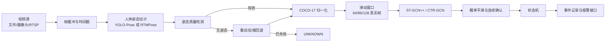
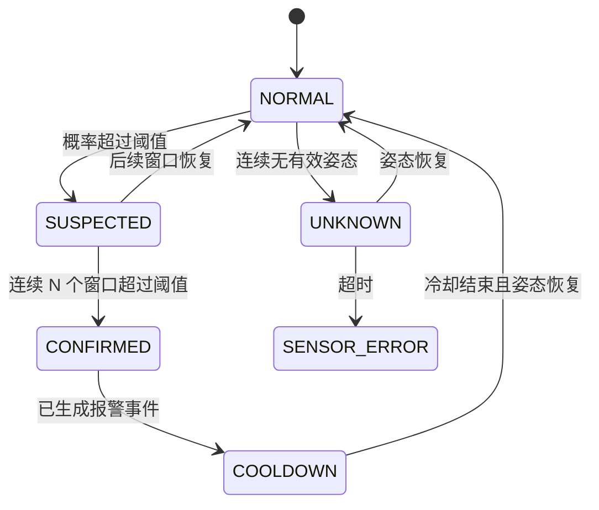

# 跌倒检测系统设计草案

## 目标

把当前离线模型封装为可替换、可观测、可回放的软件流水线。第一版预录视频流水线已经在 `app/` 中实现；设备到位后需要新增实时视频源和多人跟踪。

## 已实现原型

```powershell
python -m app.cli `
  --input "path/to/video.mp4" `
  --output-dir outputs/demo `
  --route yolo_stgcnpp
```

当前实现包括：逐帧姿态、真实连续帧缓冲、四折模型概率集成、姿态质量门控、至少 3/4 折同意、连续窗口确认、冷却状态和四类输出文件。

| 输出 | 内容 |
|---|---|
| `annotated.mp4` | 关键点、当前跌倒概率和状态 |
| `windows.jsonl` | 每个窗口的时间、四折概率、有效姿态率和状态 |
| `events.jsonl` | 仅记录确认后的跌倒事件 |
| `summary.json` | 输入信息、速度、漏检率、窗口和事件统计 |

## 模块流程



## 推荐状态机



`UNKNOWN` 与 `NORMAL` 必须区分。看不到人体不代表没有跌倒。

## 建议的内部数据对象

姿态帧：

```json
{
  "timestamp_ms": 1720000000123,
  "track_id": 1,
  "backend": "yolo_pose",
  "keypoints": [[123.4, 56.7, 0.91]],
  "valid_joint_count": 15,
  "quality": 0.82
}
```

`keypoints` 实际固定为 17 个 `[x, y, confidence]`。

分类窗口：

```json
{
  "window_start_ms": 1720000000000,
  "window_end_ms": 1720000002560,
  "track_id": 1,
  "route": "rtmpose_stgcnpp",
  "fall_probability": 0.78,
  "pose_valid_ratio": 0.94,
  "decision": "SUSPECTED"
}
```

报警事件：

```json
{
  "event_id": "fall-20260722-000001",
  "camera_id": "camera-01",
  "track_id": 1,
  "started_at": "2026-07-22T10:20:30.120+08:00",
  "confirmed_at": "2026-07-22T10:20:31.080+08:00",
  "status": "CONFIRMED",
  "fall_probability": 0.86,
  "route": "dual_stgcnpp_average",
  "pose_quality": 0.89,
  "evidence_video": "events/fall-20260722-000001.mp4"
}
```

## 第一版默认参数

| 参数 | 初始值 | 说明 |
|---|---:|---|
| 窗口 | 64 个真实连续帧 | 后续对比 96、128 帧 |
| 步长 | 16 帧 | 约 75% 重叠 |
| 单窗口阈值 | 0.5 | 设备验证集到位后校准 |
| 连续确认 | 3 个窗口 | 降低单窗口误报 |
| 姿态最低有效率 | 0.5 | 低于此值标记低质量 |
| 最少同意模型 | 3/4 折 | 抑制单折高概率造成的误报 |
| 完全无姿态 | `UNKNOWN` | 触发重试或后端回退 |
| 报警冷却 | 10 秒 | 防止重复报警 |
| 证据缓存 | 报警前 5 秒、后 10 秒 | 便于复核 |

这些是系统原型参数，不是最终实验结论。两段端到端冒烟测试中，跌倒视频确认 1 次事件，ADL 视频 0 次；设备到位后仍必须基于完整现场验证集调整。

## 软件目录建议

```text
app/
├─ sources/        视频文件、USB 摄像头、RTSP 适配器
├─ pose/           姿态后端统一接口
├─ inference/      归一化、窗口和 GCN 推理
├─ decision/       平滑、状态机和质量回退
├─ events/         JSON、视频证据和报警适配器
└─ cli.py          预录视频/摄像头命令行入口
```

下一实现阶段是增加 USB/RTSP 视频源、多人跟踪、事件前后环形视频缓存和现场验证集评估。
