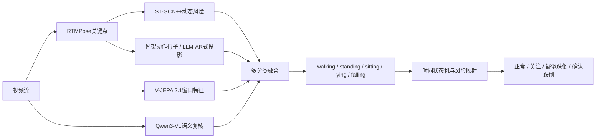

# 多模态大模型五分类动作识别实验

更新日期：2026-08-02

## 1. 为什么由二分类改为多分类

二分类只回答“跌倒/未跌倒”，无法直接展示多模态模型对姿势、动作阶段和场景语义的理解。更合理的结构是先输出可解释动作类别，再由规则或风险映射生成告警：

```text
视频片段 -> 姿势/动作类别 -> 时间一致性与风险映射 -> 跌倒告警
```

例如，“躺在床上睡眠”和“快速跌倒后躺在地面”在单帧外观上都可能是水平人体，但其动作过程、支撑物和场景关系不同。多模态模型的价值应体现在这种语义区分上，而不只是再输出一个二分类概率。

## 2. 本轮五分类标签

GMDCSA24 原始 `ADL.csv` 与 `Fall.csv` 含逐时间段动作标签。本轮从原始标注直接解析以下五类：

| ID | 类别 | 含义 | 样本数 |
|---:|---|---|---:|
| 0 | walking | 直立行走 | 59 |
| 1 | standing | 直立且基本静止 | 62 |
| 2 | sitting | 坐在床、椅子或地面 | 78 |
| 3 | lying_sleeping | 主动躺卧或在床上睡眠 | 15 |
| 4 | falling | 从站、走或坐姿向地面失控倾倒 | 78 |

共 292 个真实标注片段，4 名受试者均覆盖五类。“Reading”与坐姿或行走重叠，是活动属性而不是互斥姿态，因此本轮没有作为主类别。

数据局限：躺卧/睡眠只有15段；原始 Falling 区间通常从失稳持续标到视频结束，其中包含跌倒后的倒地画面。因此“跌倒过程”和“跌倒后躺地”尚未被单独标注。

## 3. V-JEPA 2.1-B 五分类

### 协议

- 每个动作片段均匀采样16帧。
- 冻结 V-JEPA 2.1-B，提取768维视频特征。
- 线性五分类头每折训练满300轮，使用类别权重。
- 4折 leave-one-subject-out；同一受试者的所有片段整体进入训练、验证或测试，不跨集合。
- 最佳轮次只由验证集交叉熵选择。

### 结果

| 指标 | 结果 |
|---|---:|
| 五分类 Accuracy | 53.08% |
| Macro Recall / Balanced Accuracy | 52.02% |
| Macro F1 | 48.72% |
| 回映射 Falling vs Rest BA | 71.02% |
| Falling Recall | 55.13% |
| Falling Specificity | 86.92% |

每类结果：

| 类别 | Precision | Recall | F1 |
|---|---:|---:|---:|
| walking | 58.43% | **88.14%** | 70.27% |
| standing | 65.71% | 37.10% | 47.42% |
| sitting | 67.39% | 39.74% | 50.00% |
| lying_sleeping | 11.76% | 40.00% | 18.18% |
| falling | 60.56% | 55.13% | 57.72% |

主要混淆：站立被判成行走；坐姿被判成躺卧或跌倒；跌倒被判成躺卧。冻结特征加线性分类头不能充分学习姿态边界，且不同受试者间差异明显。

## 4. Qwen3-VL-2B 五分类零样本试验

### 协议

- 使用官方 `Qwen/Qwen3-VL-2B-Instruct` BF16 权重，本地 RTX 4060 Laptop 实际推理。
- 每个片段输入8帧有序画面。
- 固定五类定义，要求模型输出JSON类别及视觉依据；不向模型提供真实标签、文件夹名、原始Description或Classes字段。
- 先进行10样本兼容性测试，再进行每类10段、共50段的平衡试验。
- 本轮是零样本试验，不训练300轮，也没有学习曲线。

### 结果

| 指标 | 结果 |
|---|---:|
| 五分类 Accuracy | 76.00% |
| Macro Recall | 76.00% |
| JSON解析失败 | 0/50 |
| 平均推理耗时 | 3.49秒/片段 |

| 类别 | Recall |
|---|---:|
| walking | 40.00% |
| standing | **100.00%** |
| sitting | **100.00%** |
| lying_sleeping | 90.00% |
| falling | 50.00% |

混淆具有清晰语义：6/10个行走片段被判成站立；5/10个跌倒片段被判成躺卧。模型擅长识别静态姿势，但对短片中的运动变化仍不够敏感。若把 falling 和 lying_sleeping 都直接映射为告警，会把正常上床睡觉误报为跌倒；必须结合骨架速度、垂直位移和“是否在床上”等信息。

若只把 `falling` 回映射为危险，Qwen在50段试验上的二分类Recall为50%、Specificity为100%、BA为75%；若把 `falling + lying_sleeping` 都映射为危险，Recall提高到100%、Specificity降至77.5%、BA为88.75%，但9/10个正常躺卧片段会被报警。这正说明多分类输出应进入时序状态机，而不是简单合并成二分类。

注意：Qwen结果来自平衡50段试验，不是292段完整LOSO结果，不能直接把76%与V-JEPA完整测试的53.08%当作严格排行榜。在完全相同的这50段上，V-JEPA OOF分类准确率为56%，每类Recall依次为90%、30%、50%、40%、70%；Qwen显示了更强的姿态语义，但跌倒动态识别并未超过V-JEPA。

## 5. 四类模型如何分工

| 模型 | 类型 | 当前可运行性 | 最适合的位置 |
|---|---|---|---|
| V-JEPA 2.1-B | 冻结视频表征模型 | 已完整实跑292段、四折×300轮 | 高频窗口特征、可训练多分类分支 |
| Qwen3-VL-2B | 生成式视觉语言模型 | 已实跑50段零样本试验 | 姿势名称、场景关系、告警解释、困难样本复核 |
| InternVideo3-8B-Instruct | 长视频智能体式多模态模型 | 官方仅发布8B权重；当前8GB显存不适合本地BF16完整运行 | 服务器端长时间视频回溯、工具调用、证据检索 |
| LLM-AR | 骨架动作识别论文框架 | 不是即插即用的视频VLM；本轮未找到作者公开的可直接复现实验仓库/权重 | 将关键点序列投影为action sentence，再由冻结LLM分类 |

InternVideo3面向长视频闭环证据积累，当前项目的2—4秒疑似窗口并不是它最有优势的任务；若以后部署服务器，可用于跨分钟回溯“跌倒前做了什么、倒地多久、是否有人施救”。

LLM-AR与本项目的结合方式反而很直接：把骨架序列转换为“躯干由竖直变水平、髋部快速下移、双膝弯曲、随后低位静止”等动作句子，再让LLM在固定类别上推理。它使用的是骨架语言化，而不是直接读取RGB。

## 6. 推荐的多分类融合架构



不建议让Qwen或InternVideo3直接覆盖安全主链路。更稳妥的是：ST-GCN++提供连续动态证据，V-JEPA提供可训练视频特征，Qwen提供开放词表语义与场景关系，最后由可审计的状态机做告警。

## 7. 下一轮应扩展的类别

现有五类仍不足以支撑真实养老场景。建议新增人工标注，形成七至八类：

1. walking；
2. standing；
3. sitting；
4. bending/squatting（弯腰、捡物、下蹲等高误报动作）；
5. intentional_lying（主动上床或躺卧）；
6. falling_transition（失稳和快速下降）；
7. post_fall_lying（跌倒后倒地未起）；
8. recovery/getting_up（自行起身或被扶起）。

其中第4、6、7、8类最有助于减少误报并实现分级预警。当前GMDCSA24无法可靠提供全部类别，必须补充UP-Fall等动作更丰富的数据或采集目标摄像机现场数据。

## 8. 结果文件

- 五分类标签清单：`data/metadata/gmdcsa24_posture5_segments.csv`
- V-JEPA特征：`results/posture5/vjepa21b_f16_features.npz`
- V-JEPA五分类结果：`results/posture5/vjepa21b_linear_probe_e300/`
- Qwen3-VL零样本结果：`results/posture5/qwen3vl2b_zero_shot_balanced50/`
- 模型对比图：`results/posture5/posture5_model_comparison.png`

官方资料：

- V-JEPA 2/2.1：https://github.com/facebookresearch/vjepa2
- Qwen3-VL：https://github.com/QwenLM/Qwen3-VL
- InternVideo3：https://github.com/OpenGVLab/InternVideo/tree/main/InternVideo3
- LLM-AR论文：https://openaccess.thecvf.com/content/CVPR2024/html/Qu_LLMs_are_Good_Action_Recognizers_CVPR_2024_paper.html
