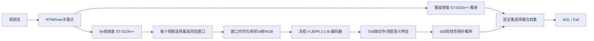

# 跌倒检测模型实跑与多模态融合报告

更新日期：2026-08-02

## 1. 本轮结论

1. 在 GMDCSA24 主体隔离四折测试中，`YOLO-Pose + ByteTrack + ST-GCN++` 的内部成绩最高，Balanced Accuracy（BA）为 **89.41%**；`RTMPose + ST-GCN++` 为 **86.83%**。
2. 在完全未参与训练的 MCFD 跨视角测试中，二者的 BA 分别为 **61.75%** 和 **63.08%**。因此，内部冠军并没有获得最好的跨场景泛化；当前系统主线仍建议采用更均衡的 `RTMPose + ST-GCN++`。
3. ByteTrack 对不同姿态前端的作用不一致。它使 YOLO-Pose 内部 BA 从 **77.53%** 提高到 **89.41%**，但给 RTMPose 加跟踪后 BA 从 **86.83%** 降到 **86.29%**；修复全零骨架帧的 ByteTrack v2 仍只有 **84.32%**。
4. 本轮新实跑了“骨架模型定位疑似窗口 → V-JEPA 2.1-B 理解局部 RGB 动作 → 分类/融合”的路线。V-JEPA 单支路 BA 从整段均匀采样的 **70.71%** 提升到 **80.01%**，说明时间窗定位有效。
5. 验证集选权重的后融合将 `RTMPose + ST-GCN++` 的 BA 从 **86.83%** 提升到 **87.51%**，F1 从 **86.27%** 提升到 **87.50%**，Recall 从 **83.54%** 提升到 **88.61%**。代价是 Specificity 从 **90.12%** 降到 **86.42%**，假阳性由 8 个增加到 11 个。
6. 直接拼接骨架特征与 V-JEPA 特征没有产生增益，四折验证集都选择 epoch 0，即保留原骨架分类器。当前多模态增益仅在后融合上成立，且幅度较小，尚不能替换主线。

## 2. 实验协议

- 数据集：GMDCSA24，共 160 个视频，其中 ADL 81 个、Fall 79 个、4 名受试者。
- 划分：4 折 leave-one-subject-out；每折 1 人测试、下一人验证、其余 2 人训练。
- 骨架输入：COCO-17，统一为 `[N, 3, 64, 17, 1]`。
- 训练：每条路线每折固定训练 300 epochs，无早停；验证集只负责选取最佳权重，测试集不参与选参。
- 完整性核验：23 条骨架路线共 92 个 fold，所有 `history.csv` 均为 300 轮；项目现有 13 项单元测试全部通过。
- 外部测试：MCFD 的 cam2/4/5/6/7/8，共 415 段；不参与训练和模型选择，以下使用固定阈值 0.5。

## 3. 两条主路线与 ByteTrack 对比

### 3.1 GMDCSA24 内部四折合并结果

| 路线 | Accuracy | BA | F1 | Recall | Specificity | FP | FN |
|---|---:|---:|---:|---:|---:|---:|---:|
| YOLO-Pose + ByteTrack + ST-GCN++ | **89.38%** | **89.41%** | **89.57%** | **92.41%** | 86.42% | 11 | 6 |
| RTMPose + ST-GCN++ | 86.88% | 86.83% | 86.27% | 83.54% | **90.12%** | **8** | 13 |
| RTMPose + ByteTrack + ST-GCN++ | 86.25% | 86.29% | 86.59% | 89.87% | 82.72% | 14 | 8 |
| RTMPose + ByteTrack v2 + ST-GCN++ | 84.38% | 84.32% | 83.44% | 79.75% | 88.89% | 9 | 16 |
| YOLO-Pose + ST-GCN++ | 77.50% | 77.53% | 77.78% | 79.75% | 75.31% | 20 | 16 |

### 3.2 MCFD 未见场景跨视角结果

| 路线 | BA | F1 | Recall | Specificity |
|---|---:|---:|---:|---:|
| YOLO-Pose + ST-GCN++ | **64.01%** | **62.28%** | 61.81% | **66.20%** |
| RTMPose + ST-GCN++ | 63.08% | 61.65% | 61.81% | 64.35% |
| YOLO-Pose + ByteTrack + ST-GCN++ | 61.75% | 61.31% | **63.32%** | 60.19% |

ByteTrack 的主要价值是多人或遮挡场景中的身份连续性。GMDCSA24 多为单人、固定机位，RTMPose 原始缓存本身没有全零骨架帧；额外跟踪反而会在快速倾倒、倒地和靠近画面边缘时丢框。原始 RTMPose+ByteTrack 中 ADL 缺失帧比例为 5.50%，Fall 为 24.39%，形成了类别相关的输入缺失。v2 虽将全零帧由 1518 降为 0，但逐帧回接仍引入时序不连续。

## 4. 新增多模态路线

### 4.1 技术路线



疑似窗口使用滑窗 RTMPose+ST-GCN++ 的 out-of-fold 结果选择：每个视频仅由未训练过该受试者的 fold 评分，取最高跌倒概率的 64 帧窗口。测试标签没有用于挑选窗口。

V-JEPA 2.1-B 使用固定版本 `ea7765861aa689985c593727725afa378fc87492`，冻结编码器，仅训练小型分类头。160/160 个窗口成功提取，特征维度 768；RTX 4060 Laptop 平均耗时 0.517 秒/视频，峰值显存约 0.336 GiB。

### 4.2 结果

| 路线 | Accuracy | BA | F1 | Recall | Specificity | FP | FN |
|---|---:|---:|---:|---:|---:|---:|---:|
| RTMPose + ST-GCN++ | 86.88% | 86.83% | 86.27% | 83.54% | **90.12%** | **8** | 13 |
| V-JEPA 2.1-B，整段均匀采样 | 70.63% | 70.71% | 72.19% | 77.22% | 64.20% | 29 | 18 |
| V-JEPA 2.1-B，骨架定位疑似窗口 | 80.00% | 80.01% | 80.00% | 81.01% | 79.01% | 17 | 15 |
| 骨架 + 疑似窗口 V-JEPA，直接特征拼接 | 86.88% | 86.83% | 86.27% | 83.54% | **90.12%** | **8** | 13 |
| 骨架 + 疑似窗口 V-JEPA，验证集选权重后融合 | **87.50%** | **87.51%** | **87.50%** | **88.61%** | 86.42% | 11 | **9** |

补充对照：疑似窗口选择器自身以 0.5 为阈值时，BA 为 80.20%、Recall 为 96.20%、Specificity 为 64.20%。因此，疑似窗口 V-JEPA 的提升不能全部解释为 V-JEPA 单独贡献，其中也包含了骨架选择器提供的时间先验；但 V-JEPA 将选择器的 FP 从 29 降至 17，表明 RGB 语义确实重排了部分误报样本。

后融合的四折权重分别为：骨架/V-JEPA = 0.10/0.90、1.00/0.00、0.55/0.45、1.00/0.00。两折完全拒绝 V-JEPA，说明当前增益具有明显受试者差异，稳定性仍不足。

## 5. 学习曲线观察

- 所有骨架路线均训练满 300 轮，但最优权重通常在前 6—185 轮出现，后续训练损失继续下降而验证指标振荡，说明小数据下存在过拟合。
- 新的疑似窗口 V-JEPA 线性探针四折最优轮次为 300、11、4、2。Subject 1 持续受益，而 Subject 3/4 很早开始过拟合，受试者域差异明显。
- 特征拼接四折均选择 epoch 0，说明在当前 160 条视频规模上，直接学习 1024 维联合特征没有可靠收益。

学习曲线文件：

- 两条主路线及 23 路总览：`results/benchmark_e300_full/`
- RTMPose + ST-GCN++：`results/benchmark_e300_full/rtmpose_stgcnpp/learning_curves.png`
- YOLO-Pose + ByteTrack + ST-GCN++：`results/benchmark_e300_full/yolo_bytetrack_stgcnpp/learning_curves.png`
- 疑似窗口 V-JEPA 线性探针：`results/vjepa21_suspicious/linear_probe_e300/learning_curves.png`
- 疑似窗口多模态特征融合：`results/vjepa21_suspicious/rtmpose_stgcnpp_feature_fusion_e300/learning_curves.png`

## 6. 最新模型的接入判断

- **V-JEPA 2.1（Meta，2026-03）**：官方强调时序一致的稠密视频特征，ViT-B 可在本机 8 GB 显存上稳定运行；本轮已经实际接入并量化效果。它适合作为疑似窗口的动作语义复核器。
- **JoyAI-VL-Interaction（京东，2026-06，2026-07 更新统一在线/离线模型）**：8B 级实时视频语言交互模型，适合在告警后生成原因解释、护理站播报和事件摘要。当前 RTX 4060 8 GB 不适合把它作为每个窗口的本地实时分类器；更合理的是部署在独立推理服务器或调用服务，对 `FALL_PENDING` 事件二次解释。
- **Qwen3-VL**：具备视频动态理解、时间戳对齐和长视频能力，可作为 JoyAI 的替代语义复核器，但同样不应直接承担高频前端检测。大模型输出还需要结构化约束和置信度校准。

官方来源：

- Meta V-JEPA 2/2.1：https://github.com/facebookresearch/vjepa2
- JoyAI-VL-Interaction：https://github.com/jd-opensource/JoyAI-VL-Interaction
- Qwen3-VL：https://github.com/QwenLM/Qwen3-VL

## 7. 推荐落地架构

推荐采用分层而不是全量串联：

1. `RTMPose + ST-GCN++` 作为默认实时主链路，侧重跨场景稳定性。
2. `YOLO-Pose + ByteTrack + ST-GCN++` 保留为多人/遮挡环境研究分支；在目标设备实拍数据上重新测定是否真正优于 RTMPose。
3. 当骨架概率进入灰区或状态达到 `FALL_PENDING` 时，截取前后约 2—4 秒 RGB，调用 V-JEPA 2.1 复核；当前后融合只能作为实验开关，不能默认上线。
4. 只有确认告警后，再将短片交给 JoyAI-VL-Interaction 或 Qwen3-VL，生成“发生了什么、倒地后是否起身、为什么告警”的自然语言解释。大模型不直接覆盖安全分类器的确定性规则。
5. 下一轮优先采集萤石目标设备的现场数据，并报告事件级误报/漏报、告警延迟、夜间/遮挡表现；当前 160 条小样本结果不能直接代表真实养老场景。

## 8. 复现入口

```powershell
# 1. 提取骨架模型选中的疑似窗口 V-JEPA 特征
.\.venv\Scripts\python.exe scripts\extract_vjepa21_suspicious_window_features.py `
  --output results\vjepa21_suspicious\gmdcsa24_vjepa21b_oof_top1_w64_f16_features.npz `
  --frames 16 --device cuda --dtype float16

# 2. 训练 300 轮 V-JEPA 线性探针
.\.venv\Scripts\python.exe scripts\train_vjepa21_probe.py `
  --features results\vjepa21_suspicious\gmdcsa24_vjepa21b_oof_top1_w64_f16_features.npz `
  --output-root results\vjepa21_suspicious\linear_probe_e300 `
  --epochs 300 --device cuda

# 3. 训练 300 轮骨架 + V-JEPA 特征融合头
.\.venv\Scripts\python.exe scripts\train_vjepa_stgcnpp_feature_fusion.py `
  --skeleton-data data\gcn\gmdcsa24_rtmpose_t64.npz `
  --splits data\splits\gmdcsa24_loso `
  --skeleton-checkpoints results\benchmark_e300_full\rtmpose_stgcnpp `
  --vjepa-features results\vjepa21_suspicious\gmdcsa24_vjepa21b_oof_top1_w64_f16_features.npz `
  --output-root results\vjepa21_suspicious\rtmpose_stgcnpp_feature_fusion_e300 `
  --epochs 300 --device cuda

# 4. 验证集选权重的分数后融合与曲线绘制
.\.venv\Scripts\python.exe scripts\evaluate_vjepa_skeleton_fusion.py `
  --skeleton-root results\benchmark_e300_full\rtmpose_stgcnpp `
  --vjepa-root results\vjepa21_suspicious\linear_probe_e300 `
  --output-root results\vjepa21_suspicious\rtmpose_stgcnpp_score_fusion

.\.venv\Scripts\python.exe scripts\plot_vjepa_suspicious_curves.py `
  --root results\vjepa21_suspicious
```

